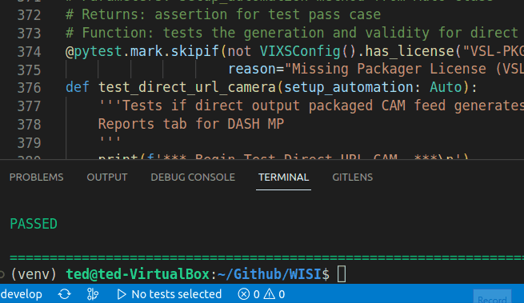
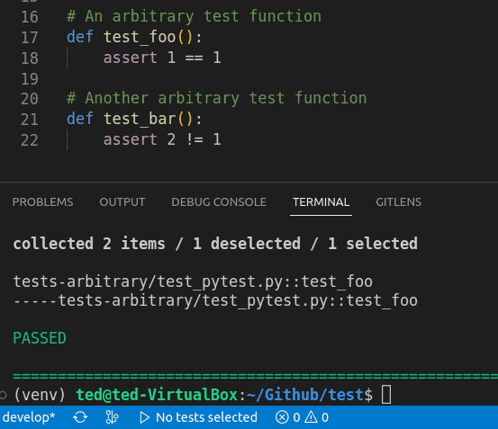

# Inca QA Test Wizard - A VS Code Extension

This is a *VS Code* extension designed and developed by John (Ted) Lee during his internship at WISI America, in order to mitigate the hassle and time-loss for WISI Inca QA regression testing when developing and running pytests for Regression.

When enabled, the extension will display a button on the Status Bar which will allow you to run tests at the click of a button.

## Usage

To use the extension, all you need is to have an active python file open. 
Once satisfied, a button will show up on the left side of your Status Bar, which you can click on after selecting test functions to run them.

You can select a test by **setting your type cursor** on the definition line of a test:

Or by **highlighting** multiple test functions you would like to run:

(CTRL+A works to select all tests)

There are two additional commands to ehance usage:
- "Run Tests by Key Word Search" (ctrl+alt+k)
- "Toggle Notification Mode"     (ctrl+alt+n)

Both commands are accessible via the Command Pallette, or by the keyboard shortcuts listed next to them as well.

**"Run Tests by Key Word Search"** enables you to enter a keyword which pytest will parse test functions to run with.
For example, entering "telemetry" when prompted, will run all test functions with the string 'telemetry' in their function name.

**"Toggle Notification Mode"** changes the way test-related notifications are displayed to you. When triggered, a VS Code notification will inform you of your
updated settings. 
- In "Pop-up Mode", a VS Code notification will appear informing you of the tests functions being run whenever you click the button.
- In "Status Mode", a message will appear on the status bar showing the function names that are run. This will dismiss itself automatically in 7 seconds.

## Requirements

This extension runs on VS Code version **1.74.0** and up, please ensure you are on a valid version of VS Code.

Usage of the extension to run Regression tests require you to have a Virtual Environment activated prior to usage.

## Known Issues

No known issues as of version 1.0.0

## Release Notes

### 1.0.0

Initial release of Inca QA Test Wizard! Base functionality is fully complete, allowing for a user to:

- Select pytest functions via highlighting or setting type cursor on definition line
- Run selected functions via clicking a Status Bar item
- Perform pytests via keyword search
- Toggle the way test-related notifications are displayed

